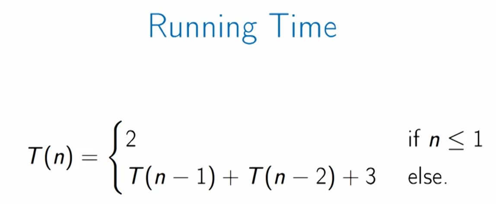
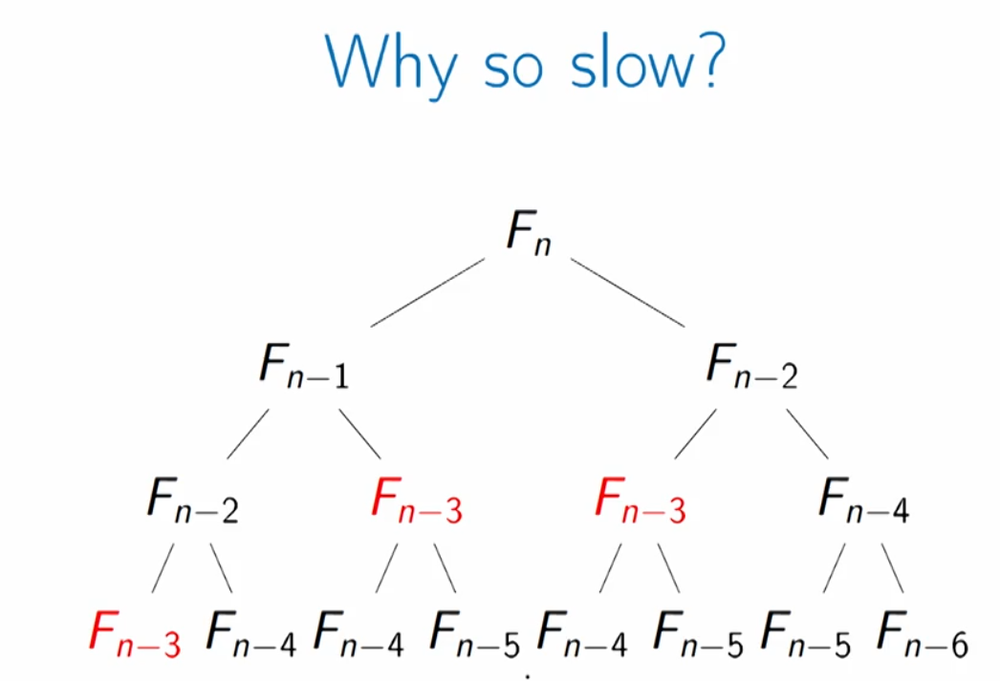

## Fibonacci Numbers

+ Problem is obvious to every one I guess, but if you wanna know more checkout [this](https://en.wikipedia.org/wiki/Fibonacci_number) wikipedia page.
+ The **recursive solutions** is very slow and its running time is as demonstrated below:

+ Why the recursive approach is so slow? Because it recomputes sub-problems over and over again.
