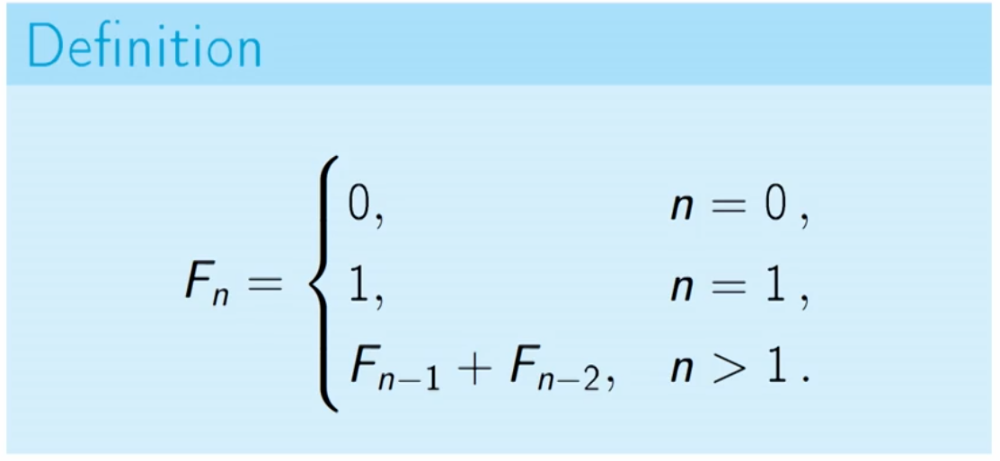
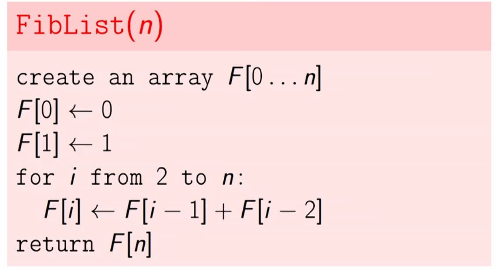
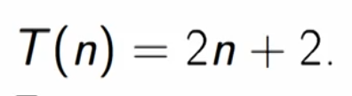

## Fibonacci Numbers

Problem is obvious to every one I guess, but if you wanna know more
checkout [this](https://en.wikipedia.org/wiki/Fibonacci_number) wikipedia page.

#### Recursive Solution

+ The **recursive solutions** is very slow and its running time is as demonstrated below:
  
+ Why the recursive approach is so slow? Because it recomputes sub-problems over and over again.
  

#### Dynamic Programming Solution

+ Instead of recomputing sub-problems again, store them somewhere and reach them anytime you want them.
+ Basically for computing `F(n)` you need to have last two elements(`F(n-1)` and `F(n-2)`).
  
+ This algorithm is way too much faster than the recursive approach as its running time is shown.

  