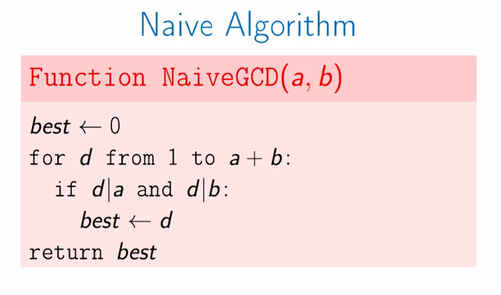
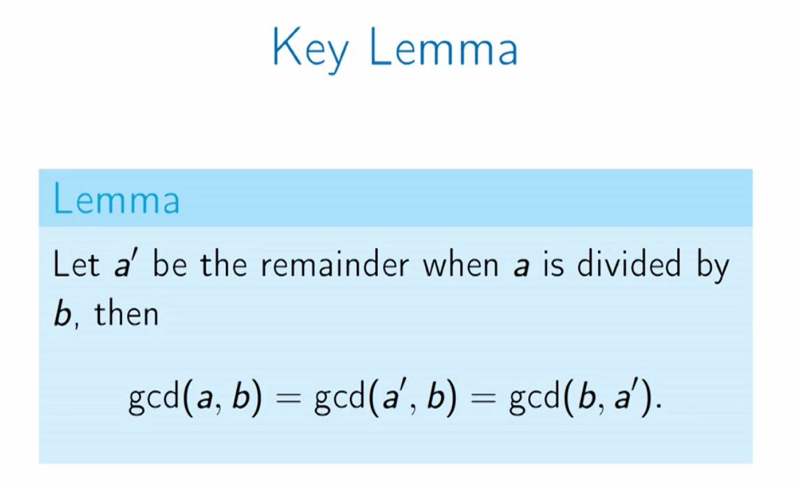
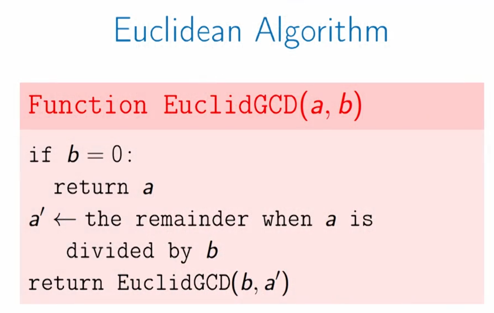
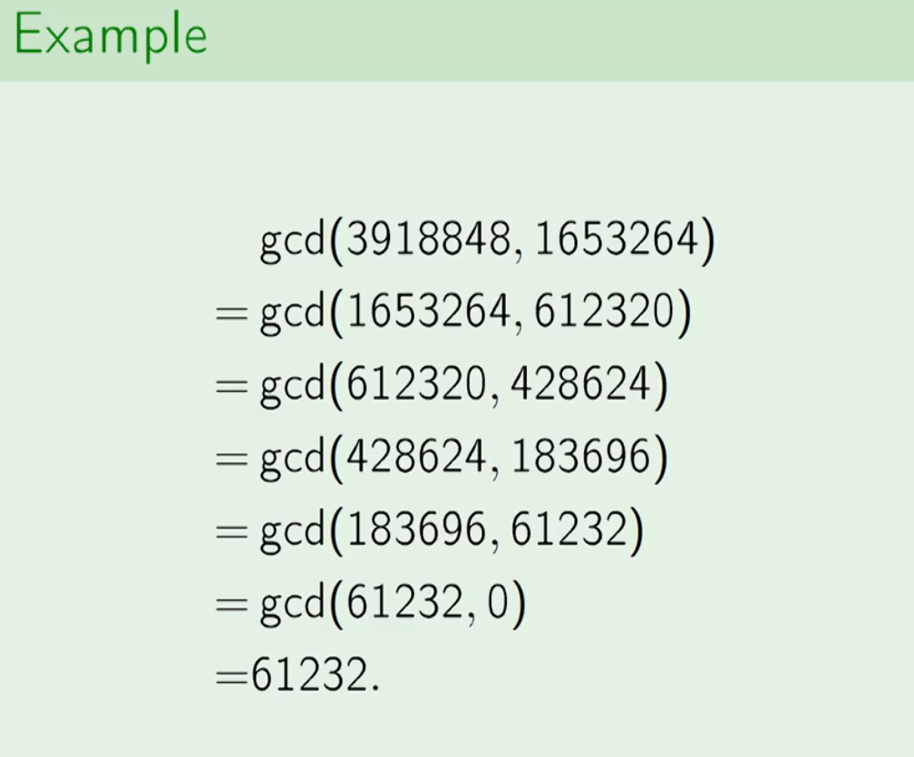
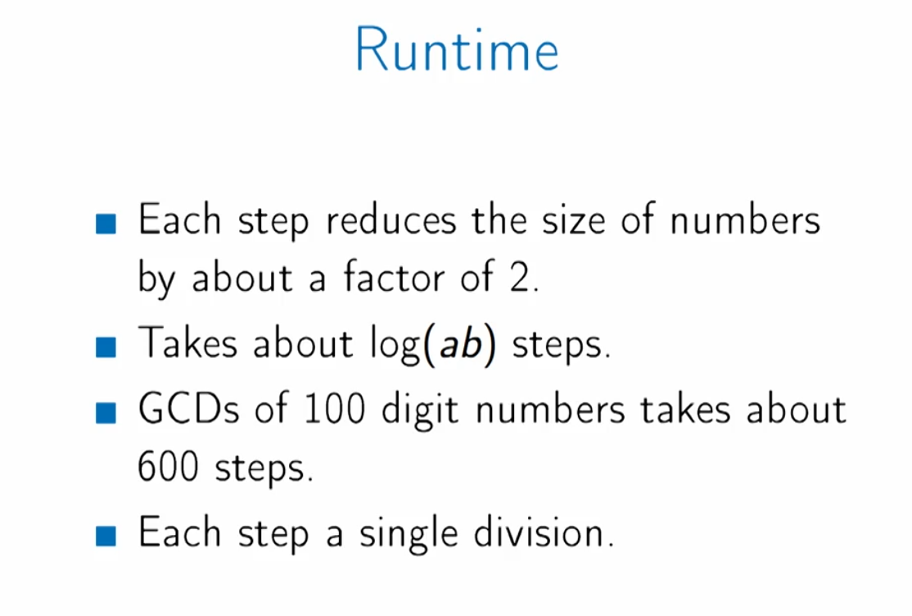

## Greatest Common Divisors

#### Problem Definition

+ Suppose that we have integers `a` and `b`, we need to find the largest integer `d` that divides both `a` and `b`.
  

+ Findig GCDs is important in Number Theories and Cryptography.
+ GCD finding algorithms must be efficient enough to run on large numbers.

#### Naive Algorithm:

+ It is Slow for large numbers and its running time is approximately `a+b`.

#### Euclidean Algorithm

+ Lemma

  
+ Proof

  

By computing gdc of `b` and `a'` we do less computation because `a'` is smaller than `a`.

+ Example

+ Runtime

